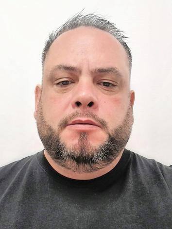

# Portfólio Profissional

## 👤 Sobre Mim 

Olá, sou Daniel Lima de Negreiros. Tenho 46 anos e sou Técnico em Informática, com ampla experiência em suporte técnico, manutenção de hardware, desenvolvimento web e design gráfico. Meu objetivo é sempre aprimorar minhas habilidades enquanto busco o desenvolvimento profissional e pessoal.

### 📧 Contato:
- 📱 Celular: (51) 99377-7133
- 📧 E-mail: [daniel.denegreiros@gmail.com](mailto:daniel.denegreiros@gmail.com)
- 🌐 [LinkedIn](#) *(https://www.linkedin.com/in/daniel-negreiros-834a8b23b/)*

---

## 🎓 Formação Acadêmica

- **Análise e Desenvolvimento de Sistemas** - UFBRA (2025)
- **Técnico em Informática** - Escola Alcides Maya (2002)

---

## 💼 Experiência Profissional

### **Simpress** (08/2021 - presente)
- **Função**: Técnico de Manutenção Elétrica de Máquinas
- **Atividades**: Atendimento ao cliente, manutenção de impressoras e controle de insumos.

### **Alert** (10/2020 - 08/2021)
- **Função**: Suporte ClaroNET
- **Atividades**: Suporte técnico para serviços de TV, internet e telefone.

### **Central do Eletrônico** (06/2017 - 08/2019)
- **Função**: Auxiliar Técnico em Informática
- **Atividades**: Formatação e configuração de computadores e notebooks, diagnóstico de problemas, vendas, atendimento ao cliente.

### **Macedo Pesca e Esporte LTDA** (10/2009 - 12/2010)
- **Função**: Web Designer e Vendedor
- **Atividades**: Desenvolvimento do site da loja (www.macedopesca.com.br), vendas de produtos e equipamentos para pesca esportiva.

---

## 🧑‍💻 Habilidades Técnicas

- **Sistemas Operacionais**: Windows (domínio completo)
- **Manutenção de Hardware**: Configuração e reparo de computadores e notebooks
- **Redes**: Configuração de redes ponto a ponto e wireless
- **Desenvolvimento Web**:
  - **Linguagens**: HTML, CSS, JavaScript
  - **Ferramentas**: Dreamweaver, Fireworks, Photoshop, Corel Draw
- **Outras Habilidades**: Atendimento ao cliente, vendas, negociação e orçamentos

---

## 📚 Cursos

- **Montagem e Configuração de Microcomputadores** - SENAC
- **Pacote Office (Word, Excel, Access, PowerPoint)** - Escola Alcides Maya
- **JavaScript** - SENAC

---

## 🌍 Idiomas

- **Inglês**: Básico Técnico

---

## 📎 Resumo

Tenho experiência prática em diversas áreas de tecnologia e atendimento ao cliente. Sou apaixonado por aprender e sempre estou buscando formas de melhorar meu conhecimento, seja em hardware, software, ou design.

---

Foi interessante entender como os serviços se conectam e podem ser escalados. A organização dos dados em diferentes camadas de acesso também é algo que pode trazer grande economia para empresas.

## 📌 Link do projeto original

Projeto proposto pela DIO:  
[https://github.com/digitalinnovationone/Microsoft_Application_Platform](https://github.com/digitalinnovationone/Microsoft_Application_Platform)

